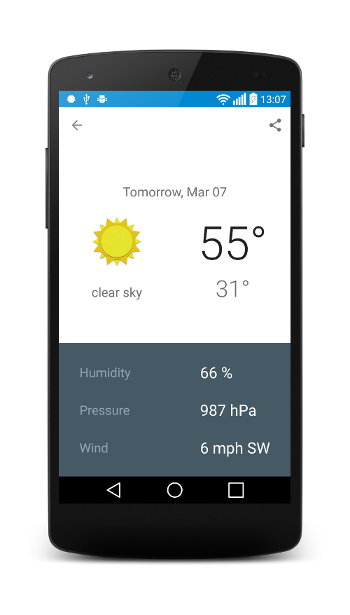

Weather Application
===================

Synchronizes weather information from OpenWeatherMap on Android Phones and Tablets. It uses SQLite database to store local information

Screenshots
-----------

