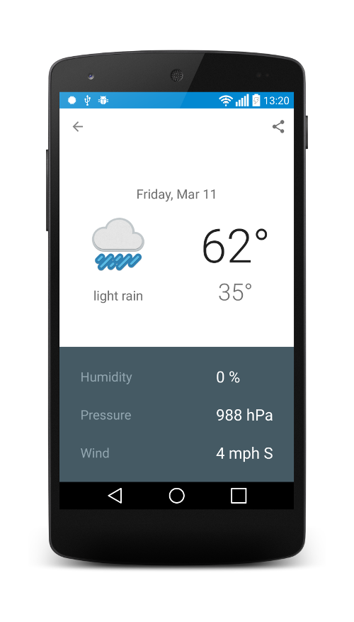

Weather Application
===================

Synchronizes weather information from OpenWeatherMap on Android Phones and Tablets

Pre-requisites
--------------
Android SDK 21 or Higher
Build Tools version 21.1.2
Android Support AppCompat 22.2.0
Android Support Annotations 22.2.0
Android Support GridLayout 22.2.0
Android Support CardView 22.2.0
Android Support Design 22.2.0
Android Support RecyclerView 22.2.0
Google Play Services GCM 7.0.0
BumpTech Glide 3.5.2

Getting Started
---------------
This sample uses the Gradle build system.  To build this project, use the
"gradlew build" command or use "Import Project" in Android Studio.

Screenshots
-----------

